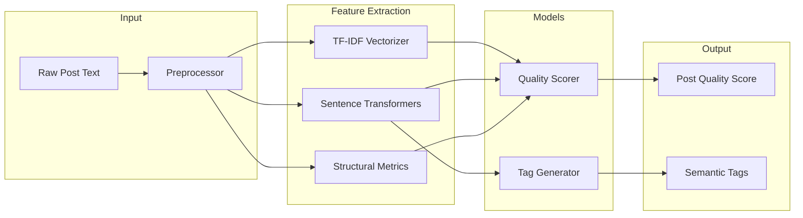

# 🧠 Discusso-ML — Semantic Inference Engine

### 🔗 [Live Demo](https://discusso-gules.vercel.app/) | [Frontend Repo](https://github.com/octoprakhar/Discusso) | [Author Portfolio](https://phantomsynth.com/)


A production-oriented ML microservice that powers **semantic post analysis, quality scoring, and tagging** for the Discusso platform.

> Built with a focus on **interpretability, error analysis, and real-world deployment constraints.**

---

## 🔄 System Flow



1. **User Interaction**: User creates a post on the Next.js frontend.
2. **Inference Trigger**: Frontend issues asynchronous calls to the ML Service.
3. **Internal Processing**: Service computes quality scores and generates semantic tags.
4. **Data Persistence**: Results are stored in the database to drive the ranking algorithm.

---

## 🔌 API Contract (Core Interface)

### 📍 Endpoints

| Method | Endpoint | Description |
| :--- | :--- | :--- |
| `POST` | `/tags` | Generate semantic tags for a post |
| `POST` | `/post-quality` | Compute post quality score |
| `GET` | `/health` | Health check (model readiness) |

### 🔐 Security Handshake
Internal API is secured using a custom header. This prevents unauthorized access to inference endpoints and ensures **service-to-service communication only**.
```http
ML_INTERNAL_SECRET: <your_secret_token>
```

### 📥 `/post-quality` — Post Scoring
**Request Body:**
```json
{
  "postId": "123",
  "title": "Why do people prefer remote work?",
  "body": "I’ve been thinking about how remote work affects productivity...",
  "karma": 10
}
```
**Response:**
```json
{
  "status": 200,
  "result": 2.43
}
```

### 📥 `/tags` — Tag Generation
**Request Body:**
```json
{
  "post_id": "123",
  "title": "Why do people prefer remote work?",
  "description": "Thinking about productivity and flexibility..."
}
```
**Response:**
```json
{ "status": "accepted" }
```
*Note: Tag generation runs asynchronously and results are persisted directly to the database.*

---

## ⚙️ Service Responsibilities

### 🔹 Post Quality Scoring
Converts raw post text into two primary metrics:
* **Effort**: Measures structural depth and cognitive investment.
* **Openness**: Evaluates the potential for triggering meaningful discussion.

**Ranking Logic:**
$$post\_quality = 2 \cdot openness + effort$$

### 🔹 Semantic Tag Generation
* Uses embedding-based similarity against a controlled tag space (`tags.json`).
* Avoids simple keyword matching to capture **true intent**.
* Includes **abstention logic** to filter out low-confidence predictions.

---

## 🧠 Model Architecture

### 🔹 Modeling Strategy
* **Openness Model**: Logistic Regression trained on S-BERT sentence embeddings.
* **Effort Model**: Hybrid features including TF-IDF (lexical richness), numerical structure (length, paragraphs), and semantic embeddings.
* **Tag Generation**: Cosine similarity between post embeddings and a predefined tag vocabulary.

### 🔹 Design Philosophy
> **Why Logistic Regression?** With a dataset of ~240 samples, complex Deep Learning models (like fine-tuned BERT) are prone to overfitting. We prioritized **Logistic Regression** on top of **Sentence-Transformers** to achieve high interpretability and stable inference in production.

---

## 📊 Performance & Optimization

* **Inference Latency**: `/post-quality` averages ~50–120ms per request.
* **Memory Footprint**: Lightweight embedding model (~90MB) shared across instances.
* **Cold Start Handling**: The `/health` endpoint ensures the model is fully loaded into memory before the service is marked "Ready" in Docker Compose.

---

## 🔬 ML Pipeline Architecture

### 🔁 Training vs. Inference
The system maintains strict separation between the **Training Pipeline** (Data ingestion → Feature Engineering → Training) and the **Inference Pipeline** (Consistent feature transformations). This ensures zero training-serving skew.

---

## 🧪 Testing & Local Development

### 🔹 Setup & Run
```bash
# Install dependencies
pip install -r requirements.txt

# Run server
uvicorn app.main:app --reload

# Run tests with coverage
pytest --cov=app
```
* **Test Coverage**: 86%+ coverage enforced via CI.

---

## 🐳 Deployment & CI/CD

### ⚙️ Configuration
| Variable | Description |
| :--- | :--- |
| `SUPABASE_URL` | Endpoint for fetching metadata or updating DB state. |
| `SUPABASE_SERVICE_ROLE_KEY` | **Secret**: High-privilege key for DB operations. |
| `ML_INTERNAL_SECRET` | **Handshake**: Must match the secret in the Frontend. |

### 🚀 CI/CD Integration
* **GitHub Actions**: Automatically runs the test suite, builds the Docker image, and pushes to Docker Hub upon merge to `main`.
* **Docker Image**: `prakhar869/discusso-backend:latest`

---

## 🎯 Closing Note
> Many classification errors arise from **semantic ambiguity**, not model limitations. This system is designed not just to classify text, but to **understand intent** and improve the quality of online discussions.
```
